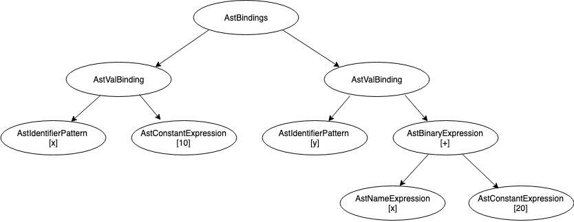
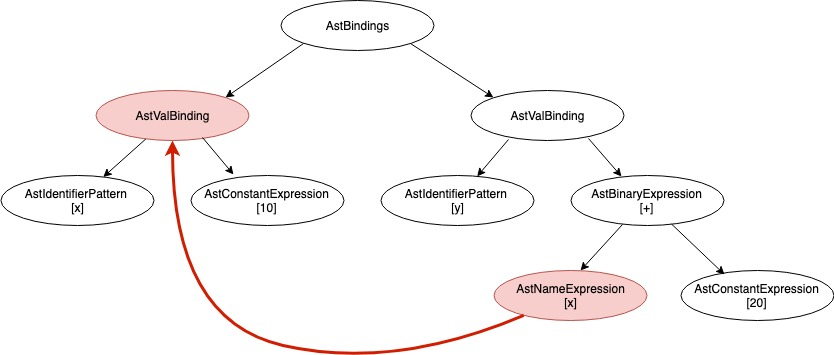

#  SML -> Racket 🚀 

Welcome to SML to Racket translator.

## Description

The goal of this project is to implement a compiler which will be able to parse `SML` code, evaluate it's semantics, and as a result produce valid `Racket` code.

_The end result can be seen here:_ https://atheris.herokuapp.com/

## Project summary  

- Tokenization (lexical analysis) of SML code
- Syntax analysis: Abstract Syntax Tree
  - core syntax
- Semantic analysis:
  - core semantics 
    - name resolving 
    - type evaluation
- Code generation: target language ==> Racket

Source code of this _translator_ is be written in `Swift`.

🚀🚀🚀

## Other relevant information
Implementation of the compiler will be based on: http://sml-family.org/sml97-defn.pdf (PDF included in `/SML/sml97-defn.pdf`)

The codebase is based on `Atheris-Swift` project, which at this point in time contains only tokenization of the `Atheris` programming language. The original compiler (written in Java) can be found at https://gitlab.com/seckmaster/atheris.

Graduation thesis: http://eprints.fri.uni-lj.si/4058/

## More about compilers

Compilers are commonly organized into several phases and linked together using common interfaces to form a complex system. 

Focusing mostly on front-end of the compilers, they perform the following (but not exclusively):

- break the source into individual words => `stream of tokens`
- syntax analysis and synthesis => `Abstract Syntax Tree` (AST)
- semantic analysis => (updated) AST
	- define what each phrase means
	- link uses of variables and other identifiers to their definitions
	- evaluate types
- frame layout => (updated) AST
	- compute activation records (more about activation records later on) 
- code generation (translation) => `intermediate representation` (IR)
	- usually, compilers translate the code into an abstract IR, from which the compiler is able to translate into another target langugage (bytecode / machine code); this compiler is different in that it directly translates code into target languge, in this case, `Racket`.

### Lexical analysis

Compiler, to be able to translate the code from one language into another, must first pull it apart, understand its structure and meaning, and then put it together in a different way.

The lexical analyser (or lexer shorter) takes as input a stream of characters and produces a stream of symbols (tokens). Tokens are usually _identifiers_, _keywords_, _operators_, _constants_, ... it discards white spaces and comments.

To see lexer in practice, lets tokenize a simple `SML` expression:

```SML
val x = 10;
```
Result:

```
[1:1, 1:4] VAL: val
[1:5, 1:6] IDENTIFIER: x
[1:7, 1:8] ASSIGN: =
[1:9, 1:11] INT_CONST: 10
[1:11, 1:12] SEMICOLON: ;
[1:12, 1:13] EOF: $
```
As we can see, the lexer produces six tokens, each represented with three components:

- position in code (very useful when reporting errors)
- tokens' string representation
and
- token's lexeme (how token actually looks in the code)

We might be wondering what the last symbols' meaning could be; it is simply just a special kind of symbol denoting that the whole code has been processed by the lexer.

Implementation of the lexer can be found in `/Lexan/` directory.

### Abstract Syntax Tree

Second phase consists of syntax analysis (or syntax parsing). The goal of this phase is to ensure that the program being translated is written grammaticaly correctly (in terms of syntax rules defined by the language).

Syntax analyser takes as input a stream of tokens produced by the lexer and produces a tree-like representation of the program called **abstract syntax tree** (AST). 

Abstract syntax tree is a data structure in which each node of the tree represents some piece of the code. __It plays a key role in the compiling process__.

To help us visualize what ASTs are and how they look, let's create a simple tree from a similar example as above:

```SML
val x = 10;
val y = x + 20;
```

Result:



The root node of our tree is an `AstBindings` note. Since SML programs are nothing else than a sequence of bindings, it makes sense that ASTs mirror this. That's why `AstBindings` node contains as it's children a list of `AstBinding` notes, where an `AstBinding` can be one of following:

- `AstValBinding`: variable binding
- `AstFunBinding`: function definition and binding to a name
- `AstDatatypeBinding`: datatypes

Taking a second look at the above diagram, we can also see another kind of a node: an `AstBinaryExpression` node. This node represents binary expressions where a binary expression is an expression which joins two other sub-expressions with an operation. Core SML language supports the following operations (note that we are not supporing operator overloading):

- arithmetic: _+, -, *, /_
- modulo: _mod_
- concatenation: _^_
- logical: _>, <, =, >=, <=, andalso, orelse_
- appending (to a list): _::_ _(here we should note that this operator is actually an overloaded operator in the SML standard library, but in this compiler we pretend that it is part of the core language)_

Obviously, this tree shows only a small subset of all AST nodes used by the compiler. To get a more comprehensing view of the implementation, navigate into the `/Atheris/Core/Syntax/` directory, where you'll find both `SyntaxParser` implementation and a list of all possible AST nodes.

### Semantics

Semantic analysis in this compiler is separated into two independent sub-phases:

1. name resolvment
2. type evaluation

In the first phase, the compiler links every _name_ with a suitable definition. If a definition isn't found, an error is reported. The result is nicely shown by the following diagram: 



As we can see the use of a name _x_ is linked with a definition defining a variable named _x_. 

In the second phase the compiler associates each node with a suitable type, as defined by the SML language. SML is a strongly & statically typed language, meaning that all of the types need to be known at compile time and that they must obey SML rules. 

An example of a syntatically correct, but semantically incorrect program:

```
val x = 10;
val y = "today is a nice day";
val z = x + y;
```

Even though there is nothing wrong with the above program in terms of syntax, we can quickly evaluate that it is not a valid program, because SML doesn't allow addition of `string` and `int` types.

Another key observation is that we actually didn't define any types explicitly (even though we could). So how does the compiler know of which types are the above expressions? The answer is that the SML, even though it's strongly typed, doesn't need explicit type annotations. A mechanism that allows this is called `type inference`. Type inference is very useful because it removes redundant typing for the programmer, where it is not needed. Let's take a look at some examples:

```
val x = 10;
```

Since the type of right hand side is known, in this case it is `int`, the compiler infers the type to the whole binding, resulting the `x` to be of type `int`.

```
val x = 1::2::[3, 4, 5];
```

This example is already a bit more complex. We quickly observer that on the right hand side we have a list of sort. Since SML requires that the types of all elements of a list are of the same type the compiler must ensure that. Luckily, all types are `int`. The second part of the evaluation must ensure, that the left hand side of the `::` operator is not a list and the right hand side is. The `::` binds from the right to the left, meaning that we can write the expression also as `1::(2::[3, 4, 5])`. Appending two to the list results in `1::[2, 3, 4, 5]`. We clearly see now that this example is semantically valid.

```
fun f x = x + 100;
```

This function accepts one parameter and returns it's value added by `100`. But we don't know of which type `x` is ... 🤔 Well, let's think about it. We know that `100` is an `int`. We also know that if on one side of `+` is an `int`, the other side also must be. Meaning that `x` has to be an `int`! We successfuly evaluated the functions type to be `val f: int -> int`. 🥇

In fact, SML's type inference is so powerful, that we can write very complex programms without ever needing to explicitly write types. And it is also the reason why writing a `type-checker`  for SML is not an easy task.

### Activation records

Even though this phase of the compilation is skiped in this compiler, we still briefly mention it and explain some key concepts:

In almost any modern programming language, a funcation can contain _local_ variables which are created upon entry to the function. Several invocation of the function may exist at the same time, and each invocation has its own _instantiations_ of local variables (multiple calls, recursion, ...). To keep track of this we need a special data structure and a mechanism for managing it.

#### Stack frames

Stack frame is a batch of memory containing all the data needed for function execution. It contains `local variables`, `parameters`, some special pointers like `stack pointer`, `frame pointer`, `return address`, ...

Stack frames live in a data structure called `Stack`. The simplest notion of a `stack` is a data structure which supports `push` and `pop` operations. For every function call a new `stack frame` is created and `pushed` on the stack. When the function returns (ends it's execution), the `stack frame` is `poped`.

### Code generation

The last phase of the compilatation is `code generation`. For each node in the AST, the compiler associates it with an IR representation construct. A good IR has a couple of properties:

- it must be convenient to produce
- it must be convenient to translate it into a real machine language
- each construct must have a clear and simple meaning

Generating Racket code is in a way very similar to generating IR code. For each AST node we generate appropriate code.

----
_Referencing material:_


[1] _Modern Compiler Implementation in Java - Andrew W. Appel_  

[2] _Vgradnja objektno usmerjenih gradnikov v programski jezik PINS - Toni K.T. 
http://eprints.fri.uni-lj.si/4058/_